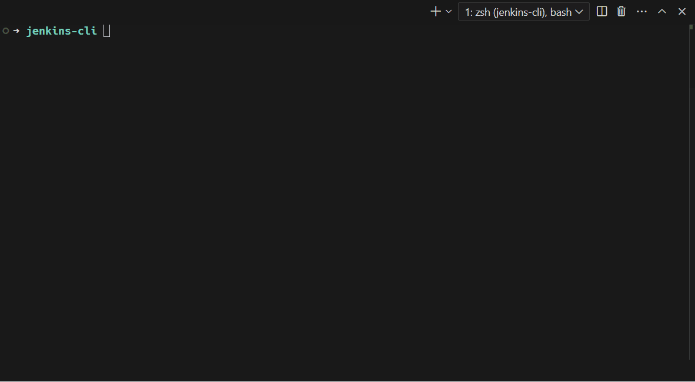

# jenkins-cli

Cross-platform CLI tool for triggering Jenkins builds. Written in Rust for high performance.

[中文文档](README_zh.md)

## Features

- Fast and efficient Jenkins job deployment
- Intuitive command-line interface with real-time console output
- Support for multiple Jenkins services, project filtering
- Common Jenkins operations support (e.g., triggering builds)
- High performance and cross-platform compatibility (Mac, Windows, Linux)
- Remembers last build parameters for quick re-runs
- Supports parameter presets for saving multiple reusable parameter sets per Job
- Optionally follows downstream builds triggered by the current build

### Demo



## Installation

To install the Jenkins CLI tool, use one of the following methods:

```bash
bash <(curl -fsSL https://raw.githubusercontent.com/kairyou/jenkins-cli/main/scripts/install.sh)
```

Or use EdgeOne mirror (if GitHub is inaccessible)

```bash
bash <(curl -fsSL https://jenkins-cli.xhl.io/scripts/install.sh)
```

If you have Rust and Cargo installed, you can install Jenkins CLI directly from crates.io:

```bash
cargo install jenkins
```

Alternatively, you can download the binary file from the [Releases page](https://github.com/kairyou/jenkins-cli/releases).

## Usage

After setting up the configuration file (see [Configuration](#configuration) section), you can simply run:

```bash
jenkins
```

This command will:

1. Prompt you to select a Jenkins service (if multiple are configured)
2. Display a list of available projects
3. Select a project, then choose a parameter preset, last build parameters, or re-enter parameters
4. Trigger the build and show real-time console output

Ctrl+C behavior:
- During selection: go back to the previous step
- During queue/build: confirm whether to cancel
- Press twice quickly: force exit

You can also use command line arguments:

```bash
# Run with Jenkins project URL - Deploy project directly without selection
jenkins -U http://jenkins.example.com:8081/job/My-Job/ -u username -t api_token

# Run with Jenkins server URL - Show project list for selection and deploy
jenkins -U http://jenkins.example.com:8081 -u username -t api_token

# Run with Jenkins auth cookie (e.g. jwt_token) - Use only when API token is not accepted
jenkins -U http://jenkins.example.com:8081 --cookie "jwt_token=your-jwt"

# Run a specific job with a saved parameter preset
jenkins -U http://jenkins.example.com:8081/job/My-Job/ --preset release-main
```

Available command line options:
- `-U, --url <URL>`: Jenkins server URL or project URL
- `-u, --user <USER>`: Jenkins username
- `-t, --token <TOKEN>`: Jenkins API token
- `-c, --cookie <COOKIE>`: Jenkins auth cookie (e.g. jwt_token=...)
- `--preset <PRESET>`: Use a saved parameter preset for the specified Jenkins job URL

### Parameter Presets

`history` still automatically records the most recent actual build parameters for each Job. For common release scenarios, you can explicitly save the current parameters as a parameter preset from the CLI, then select it the next time you open the same Jenkins service and Job.

Parameter presets are scoped by `Jenkins service + Job`, so preset names do not need to be globally unique. Different Jenkins services or different Jobs can all have a preset named `release-main`.

For shortcut builds, use `--preset` together with a Jenkins job URL:

```bash
jenkins -U http://jenkins.example.com:8081/job/My-Job/ --preset release-main
```

Runtime data is stored in:

```text
~/.jenkins-cli/history.toml   # automatically recorded last build parameters
~/.jenkins-cli/presets.toml   # user-saved parameter presets
```

## Configuration

Create a file named `.jenkins.toml` in your home directory with the following content:

```toml
# $HOME/.jenkins.toml
[config]
# locale = "en-US" # (optional), default auto detect, e.g. zh-CN, en-US
# enable_history = false # (optional), default true
# check_update = false # (optional), default true
# timeout = 30 # (optional), HTTP request timeout in seconds, default 30
# follow_downstream = false # (optional), default false, follow downstream builds triggered by the current build

[[jenkins]]
name = "SIT"
url = "https://jenkins-sit.example.com"
user = "your-username"
token = "your-api-token"
# includes = []
# excludes = []

# [[jenkins]]
# name = "PROD"
# url = "https://jenkins-prod.example.com"
# user = "your-username"
# token = "your-api-token"
# includes = ["frontend", "backend"]
# excludes = ["test"]
```

### Configuration Options

- `config`: Global configuration section
  - `locale`: Set language (optional), default auto detect, e.g. "zh-CN", "en-US"
  - `enable_history`: Remember last build parameters (optional), default true, set to false to disable
  - `check_update`: Automatically check for updates (optional), default true, set to false to disable
  - `timeout`: HTTP request timeout in seconds (optional), default 30
  - `follow_downstream`: Follow downstream builds triggered by the current build (optional), default false
- `jenkins`: Service configuration section (supports multiple services)
  - `name`: Service name (e.g., "SIT", "UAT", "PROD")
  - `url`: Jenkins server URL
  - `user`: Your Jenkins user ID
  - `token`: Your Jenkins API token
  - `includes`: List of strings or regex patterns to include projects (optional)
  - `excludes`: List of strings or regex patterns to exclude projects (optional)
  - `enable_history`: Remember build parameters (optional), overrides global setting if specified
  - `cookie`: Optional, Jenkins auth cookie (e.g. jwt_token=...). Sends a Cookie header when set.
  - `cookie_refresh`: Optional, cookie auto-update configuration (updates the `cookie` value)
    - `url`: Refresh endpoint URL
    - `method`: HTTP method, default "POST"
    - `request`: Optional, request parameters (replaces `${cookie.<name>}` placeholders with values from the `cookie` field):
      - `headers`: Optional, extra request headers (for example `X-Client-Id = "your-client-id"`)
      - `query`: URL query parameters
      - `form`: x-www-form-urlencoded body parameters
      - `json`: JSON body payload (supports string/number/boolean/object/array)
    - `cookie_updates`: Optional, cookie updates extracted from the response (written back to the `cookie` field):
      - `body.json:<path>`: JSON body path, e.g. `body.json:data.refreshToken`
      - `header:<name>`: Response header name, e.g. `header:X-JWT-Token`
      - `body.regex:<pattern>`: Regex against response body, use capture group 1, e.g. `body.regex:token=([\\w.-]+)`

### Cookie Authentication (Optional)

Most users should use `user` + `token`. Cookie auth is an optional fallback for setups that do not accept API tokens.

Note: If you have an extra endpoint to refresh cookie values, configure `cookie_refresh` to call it and write back to `cookie`; otherwise you can ignore `cookie_refresh`.

```toml
[[jenkins]]
name = "Cookie-Refresh"
url = "https://jenkins.example.com"
cookie = "jwt_token=your-jwt"

[jenkins.cookie_refresh]
url = "https://auth.example.com/api/refresh-token"
method = "POST"
# Pick one request style:
# request.query = { refreshToken = "${cookie.jwt_token}" } # send via query params
request.json = { refreshToken = "${cookie.jwt_token}" } # send via JSON body
cookie_updates = { jwt_token = "body.json:data.refreshToken" }
```

Login API example (token returned in JSON body):

```toml
[[jenkins]]
name = "Login-Refresh"
url = "https://jenkins.example.com"

[jenkins.cookie_refresh]
url = "https://auth.example.com/api/auth/login"
method = "POST"
# Optional custom headers:
# request.headers = { X-Client-Id = "your-client-id" }
request.json = { username = "your-username", password = "your-encrypted-password", remember = true }
cookie_updates = { jwt_token = "body.json:data.token" }
```

### Project Filtering

You can use `includes` or `excludes` to filter projects:

- `includes: ["frontend", "backend", "^api-"]` # Include projects containing [frontend, backend, api-]
- `excludes: ["test", "dev", ".*-deprecated$"]` # Exclude projects containing [test, dev, *-deprecated]

Note: Regex patterns are case-sensitive unless specified otherwise (e.g., `(?i)` for case-insensitive matching).

### Username and API Token

Your Jenkins username is typically the same as your login username for the Jenkins web interface.

To generate an API token:

1. Log in to your Jenkins server
2. Click on your name in the top right corner
3. Click on `Configure` in the left sidebar
4. In the `API Token` section, click `Add new Token`
5. Give your token a name and click "Generate"
6. Copy the generated token and paste it into your `.jenkins.toml` file

Note: Keep your API token secure. Do not share it or commit it to version control.

## TODOs

- [x] Support multiple Jenkins services
- [x] Support string and text parameter types
- [x] Support choice parameter type
- [x] Support boolean parameter type
- [x] Support password parameter type
- [x] Auto-detect current directory's git branch
- [x] Remember last selected project and build parameters
- [x] Save Job parameter presets
- [x] i18n support (fluent)
- [x] Automatically check for updates

## Stargazers over time
[](https://starchart.cc/kairyou/jenkins-cli)

## License

This project is licensed under the MIT License - see the [LICENSE](LICENSE) file for details.
