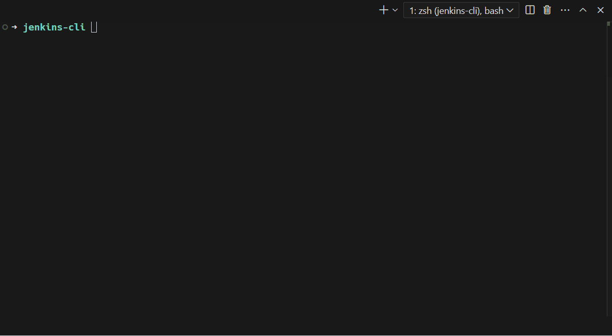

# jenkins-cli

一个用 Rust 编写的强大高效的 Jenkins CLI 工具。通过命令行简化 Jenkins 的项目部署。

[English](README.md)

## 特性

- 快速高效部署 Jenkins 任务
- 直接用命令行发布，提供实时控制台输出
- 支持多个 Jenkins 服务，支持项目过滤
- 支持常见 Jenkins 操作（如触发构建）
- 高性能且跨平台支持（Mac、Windows、Linux）
- 支持记住上次构建参数，便于下次快速构建

### 演示



## 安装

安装 Jenkins CLI 工具，请使用以下方法之一：

```bash
bash <(curl -fsSL https://raw.githubusercontent.com/kairyou/jenkins-cli/main/scripts/install.sh)
```

或使用 ghp.ci 镜像(如果无法访问 GitHub)

```bash
bash <(curl -fsSL https://ghp.ci/raw.githubusercontent.com/kairyou/jenkins-cli/main/scripts/install.sh)
```

如果已安装 Rust 和 Cargo，可以直接从 crates.io 安装：

```bash
cargo install jenkins
```

或者，可以从 [Releases 页面](https://github.com/kairyou/jenkins-cli/releases) 下载二进制文件。

## 使用

在设置好配置文件（见[配置](#配置)部分）后，可以直接运行：

```bash
jenkins
```

该命令将：

1. 提示选择一个 Jenkins 服务（如果配置了多个服务）
2. 显示可用的项目列表
3. 选择一个项目, 设置构建参数
4. 触发构建并实时输出控制台日志

或使用命令行参数：

```bash
# 使用 Jenkins 项目地址运行 - 无需选择直接发布指定项目
jenkins -U http://jenkins.example.com:8081/job/My-Job/ -u username -t api_token

# 使用 Jenkins 服务器地址运行 - 显示项目列表选择并发布
jenkins -U http://jenkins.example.com:8081 -u username -t api_token
```

可用的命令行选项：
- `-U, --url <URL>`: Jenkins 服务器地址或项目 URL
- `-u, --user <USER>`: Jenkins 用户名
- `-t, --token <TOKEN>`: Jenkins API 令牌

## 配置

在`$HOME`目录下创建一个名为`.jenkins.toml`的文件，内容如下：

```toml
# $HOME/.jenkins.toml
[config]
# locale = "en-US" # (可选), 默认自动检测，例如 zh-CN, en-US
# enable_history = false # (可选), 默认 true
# check_update = false # (可选), 默认 true

[[jenkins]]
name = "SIT"
url = "https://jenkins-sit.your-company.com"
user = "your-username"
token = "your-api-token"
# includes = []
# excludes = []

# [[jenkins]]
# name = "PROD"
# url = "https://jenkins-prod.your-company.com"
# user = "your-username"
# token = "your-api-token"
# includes = ["frontend", "backend"]
# excludes = ["test"]
```

### 配置选项

- `config`: 全局配置部分
  - `locale`: 设置语言 (可选), 默认自动检测，例如 "zh-CN", "en-US"
  - `enable_history`: 记录上次的构建参数 (可选), 默认 true, 设置为 false 以禁用
  - `check_update`: 自动检查更新 (可选), 默认 true, 设置为 false 以禁用
- `jenkins`: 服务配置部分 (支持多服务)
  - `name`: Jenkins 服务名称 (例如 "SIT", "UAT", "PROD")
  - `url`: Jenkins 服务器地址
  - `user`: 你的 Jenkins User ID
  - `token`: 你的 Jenkins API token
  - `includes`: 包含项目的字符串或正则表达式列表 (可选)
  - `excludes`: 排除项目的字符串或正则表达式列表 (可选)
  - `enable_history`: 记录上次的构建参数 (可选), 设置后覆盖全局设置

### 项目过滤

可以使用 `includes` 或 `excludes` 来过滤项目：

- `includes: [ "frontend", "backend", "^api-" ]` # 包含含有 [frontend, backend, api-] 的项目
- `excludes: [ "test", "dev", ".*-deprecated$" ]` # 排除含有 [test, dev, *-deprecated] 的项目

注意：正则表达式模式默认区分大小写，除非另有指定（例如，使用 `(?i)` 进行不区分大小写的匹配）。

### 用户和 API 令牌

Jenkins User ID 就是登录 Jenkins 网页界面的用户名。

生成 API 令牌的步骤：

1. 登录 Jenkins 服务器
2. 点击右上角的你的名字
3. 在左侧边栏中点击"配置"
4. 在 API 令牌部分，点击"添加新令牌"
5. 为你的令牌命名，然后点击"生成"
6. 复制生成的令牌，并将其粘贴到你的`.jenkins.toml`文件中

注意：请妥善保管你的 API 令牌。不要分享或将其提交到版本控制系统��。

## TODOs

- [x] 支持多个 Jenkins 服务
- [x] 支持 string 和 text 类型参数
- [x] 支持 choice 类型参数
- [x] 支持 boolean 类型参数
- [x] 支持 password 类型参数
- [x] 自动读取当前目录 git 分支
- [x] 记录上次选择的项目/构建参数
- [x] i18n 支持 (fluent)
- [x] 自动检查更新

## 许可证

本项目采用 MIT 许可证 - 详情请参阅 [LICENSE](LICENSE) 文件。
